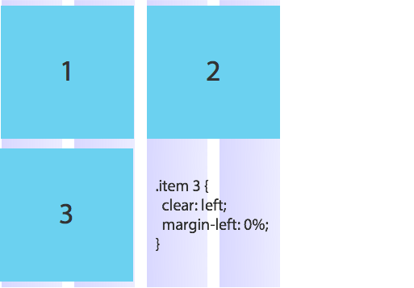

## 15일차 수업 내용 요약

#### Susy2

스마트한 Susy 그리드 시스템 프레임워크
* 정적(Static) 레이아웃
* 중첩(Nested) 레이아웃
* 반응형(Fluid) 레이아웃
* 적응형(Adaptive) 레이아웃

---

#### Float Isolate 테크닉

##### 문제와 해결책
* [Sub Pixel 랜더링 문제](http://ejohn.org/blog/sub-pixel-problems-in-css/)
* [Sub Pixel 랜더링 해결책](http://thelucid.com/2010/12/03/the-solution-to-fluid-inconsistencies-and-equal-height-columns/)

-

##### 해결책 원리 설명

__isolate 테크닉에 요구되는 사항__ 
※ 테크닉 사용시 혼란이 올 수 있으니, 음수 마진 값 설정에 대한 이해를 반드시 하셔야 합니다!

* 개별 레이아웃 요소는 `margin-left` 값을 통해 정확한 위치를 설정합니다.
* 개별 레이아웃 요소는 `margin-right: -100%;`를 사용하여 뒤에 오는 요소를 끌어(pull) 당깁니다.

-

###### STEP 1

__3 컬럼 레이아웃__을 디자인한다고 가정합시다.

-

###### STEP 2

아이템1에 `margin-left: 0;`을 설정하여 왼쪽 끝 시작 점에 맞춥니다. 이어서 `margin-right: -100%;` 값을 설정하여 아이템2를 시작점으로 끌어옵니다.

-

###### STEP 3

아이템2 요소에 `margin-left` 속성 값을 퍼센트(%)로 설정하여 3번째 컬럼의 위치( 컬럼x2 + 거터x2 )로 이동시킵니다.

이어서 아이템2 요소에 `margin-right: -100%`를 설정하여 아이템3 요소를 끌어 당깁니다.

그러면 아이템3 요소는 시작점으로 이동하게 됩니다.

-

###### STEP 4

아이템3 요소에 `margin-left` 속성 값을 퍼센트(%)로 설정하여 5번째 컬럼의 위치( 컬럼x4 + 거터x4 )로 이동시킵니다.

※ 이와 같은 패턴으로 각각의 레이아웃 요소에 정확한 레이아웃을 설정하면 Sub Pixel 문제에서 벗어날 수 있습니다. 이와 같은 레이아웃 방법을 Isolate 레이아웃이라고 합니다.

-

###### STEP 5

만약 아이템3 요소를 다음 행(Row)의 시작점에 위치하여 레이아웃을 설정하고자 한다면, 먼저 `clear: left` 속성을 설정하여 Clear 영향권에서 벗어납니다.

그리고 `margin-left: 0`을 설정하여 시작점으로 이동시킵니다. 간단하죠? :-)

---

### 수업자료 PDF 다운로드
<!-- [네이버 카페 게시글 첨부자료](http://cafe.naver.com/webstandardproject/3996) -->

---

### 과제
<!-- - 지난 수업 시간에 __공부한 내용 복습 열심히__ 하기!
- __Sass & Compass를 활용 사이트__ `Sass`, `Compass` ⇒ `CSS` 스타일링 -->