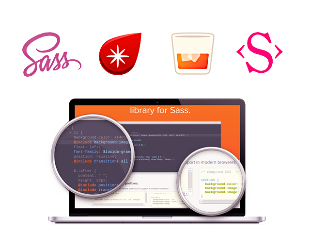

## Sass & Frameworks를 활용한 반응형 웹디자인

[SASS & Frameworks를 활용한 '반응형 웹 디자인' 모던 워크플로우 실무 향상](http://www.kipfa.or.kr/Education/EduCenter/EduCenterView.aspx?eduSeqNo=574) 수업자료를 제공합니다. CSS 중심의 반응형 웹디자인(흔하디 흔한 과정)과는 구축과 운영 측면(생산성, 관리효율)에서 차원이 다른 반응형 웹 모던 사이트 제작 워크플로우를 배우는 과정입니다.

---

## 수업 진행내용 요약

- [01일차](DATA/DAY01/README.md)
- [02일차](DATA/DAY02/README.md)
- [03일차](DATA/DAY03/README.md)
- [04일차](DATA/DAY04/README.md)
- [05일차](DATA/DAY05/README.md)
- [06일차](DATA/DAY06/README.md)
- [07일차](DATA/DAY07/README.md)
- [08일차](DATA/DAY08/README.md)
- [09일차](DATA/DAY09/README.md)
- [10일차](DATA/DAY10/README.md)